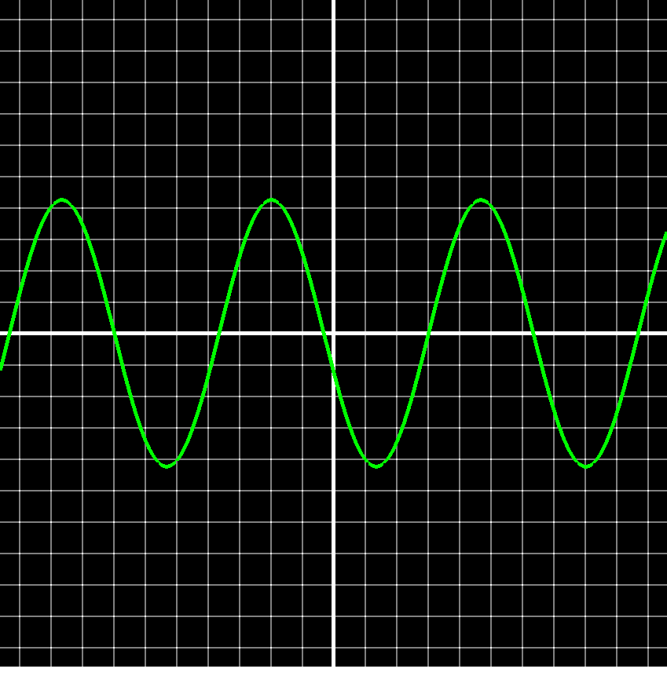
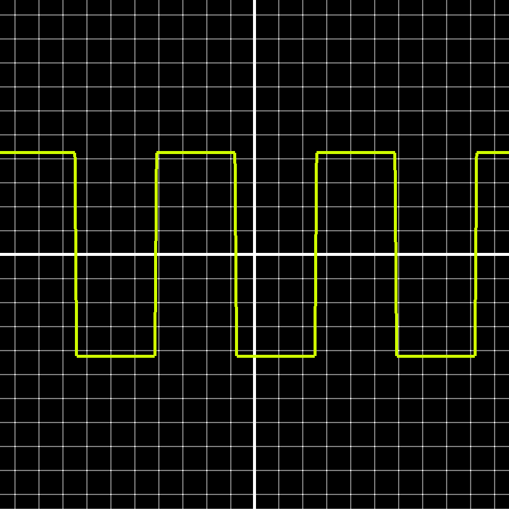
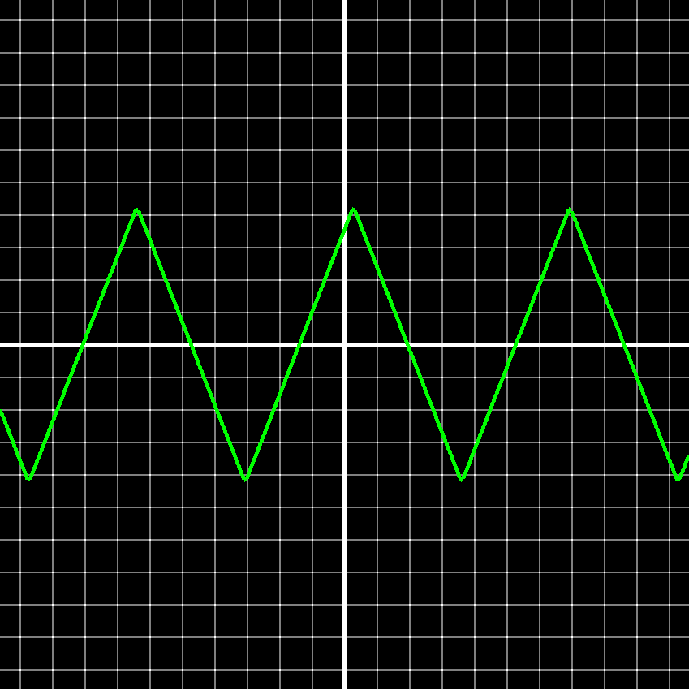
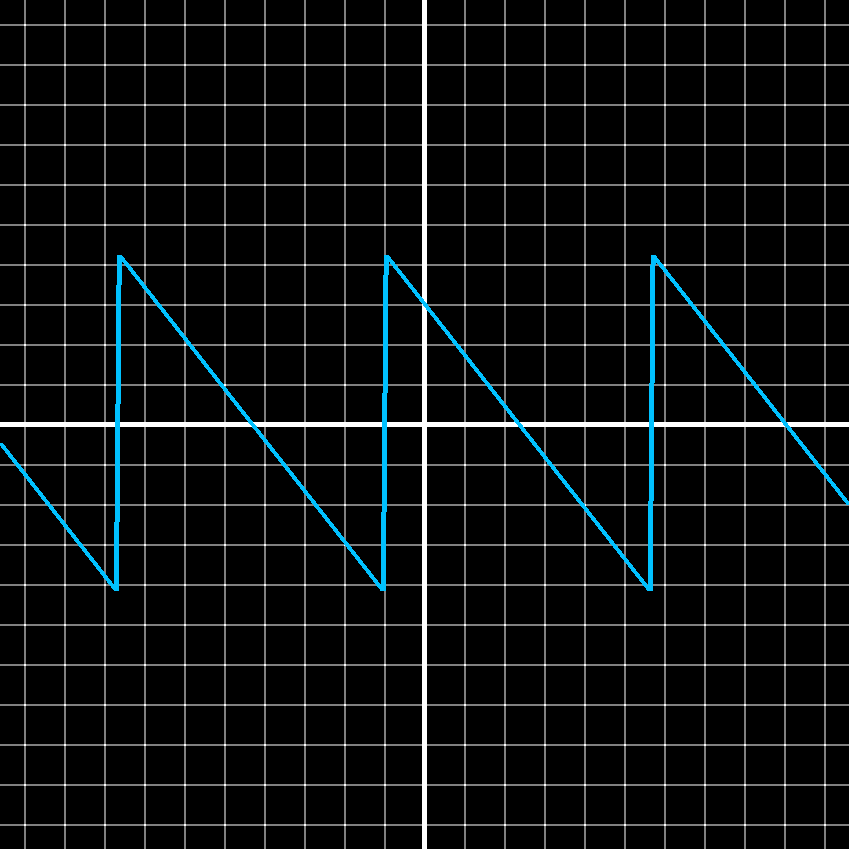
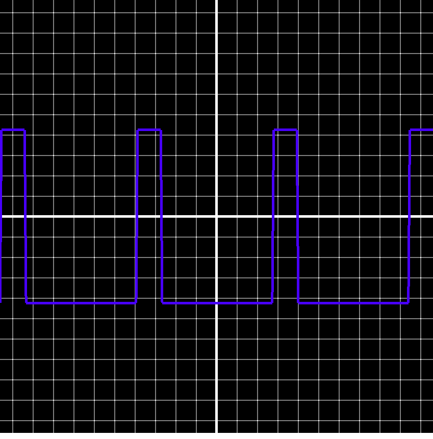
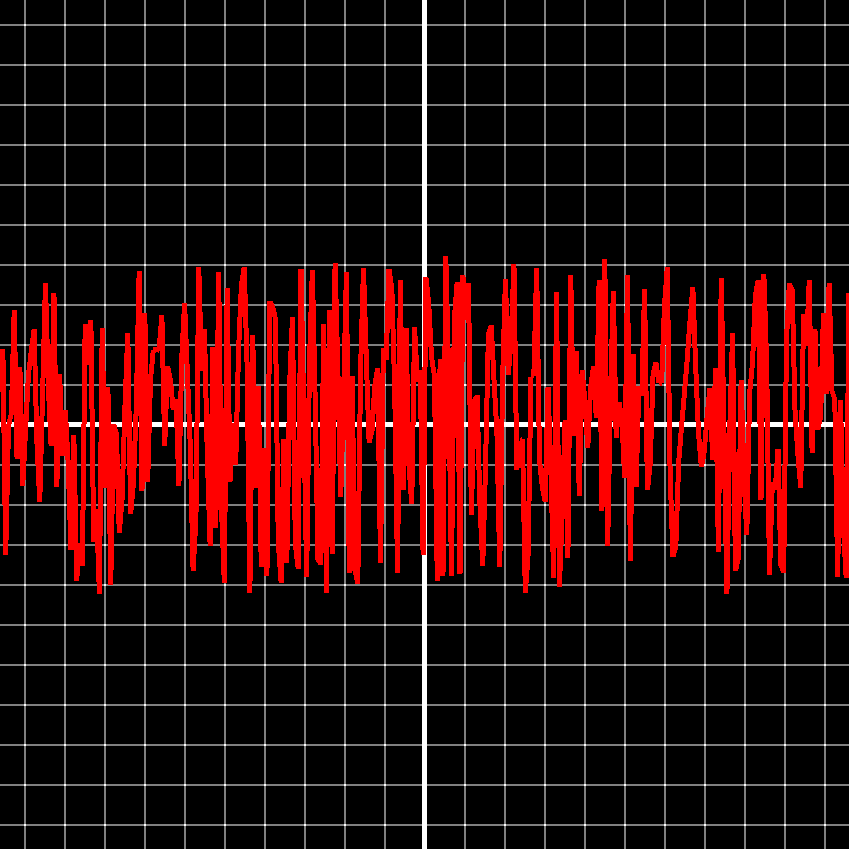
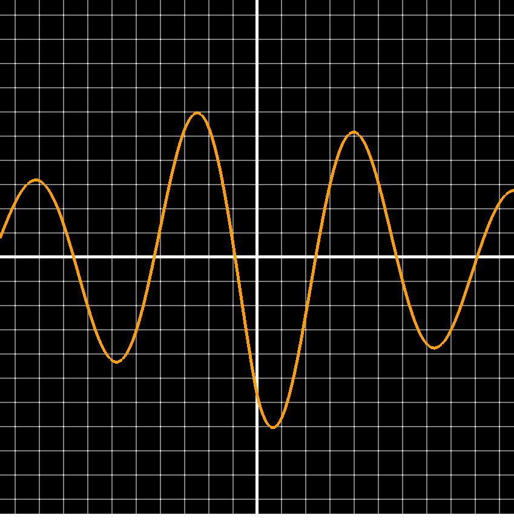

Frequency Visualizer is a small real-time tool for drawing and playing with signal shapes. It came
out of two things at once: I like signals and waveforms, and I wanted another focused piece to
build on my own C++ application framework. The appeal is immediacy, move a slider and the wave
redraws under your hand.

## What it does

Nine waveform types, all rendered live:

- Sine and absolute sine
- Cosine
- Square
- Triangle
- Sawtooth
- Pulse, with duty-cycle control
- Noise
- Exponential decay

Each is driven by parameters you adjust on the fly: **amplitude**, **speed**, **period**, **line
thickness**, **sample count**, and **colour**, plus a waveform inversion toggle. Nothing waits for a
re-render, so the effect of every parameter is visible the instant you touch it.

<ImageGallery>

</ImageGallery>

## Built on my framework

The whole thing runs on Lumina, my C++ application framework, which wraps OpenGL and an
immediate-mode UI into a simple application shell. That's what keeps a tool like this small: the
framework owns the window, the render loop, and the panels, so the project itself is almost
entirely the waveform math and how it's drawn.

## Where it's going

Frequency Visualizer is due for a major overhaul like the rest, so this is its current form, not the
finished one.

## Tech stack

| Layer | Technology | Role |
| --- | --- | --- |
| Language | C++ | The waveform generation and rendering |
| Graphics | OpenGL | The real-time line rendering |
| UI | Dear ImGui | The parameter panels |
| Framework | Lumina, my C++ application framework | Windowing, the render loop, and the UI shell |
| Build | Visual Studio (Windows) | Where it compiles and runs |
