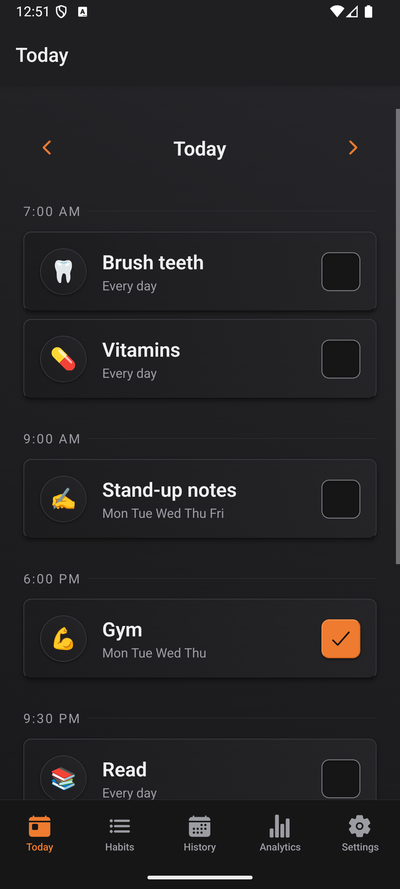
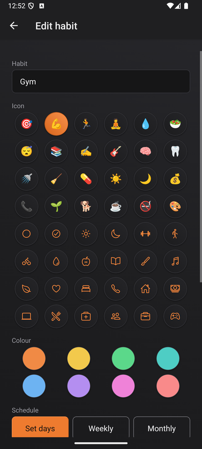
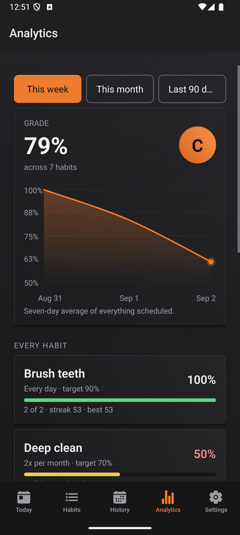
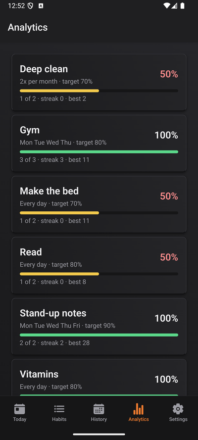
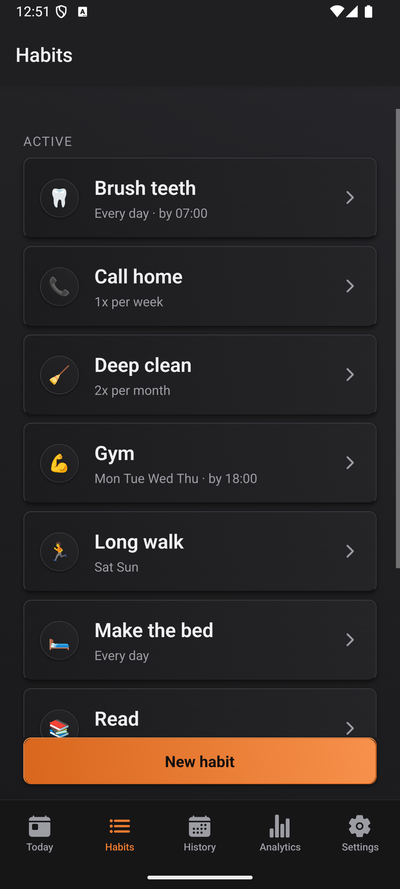
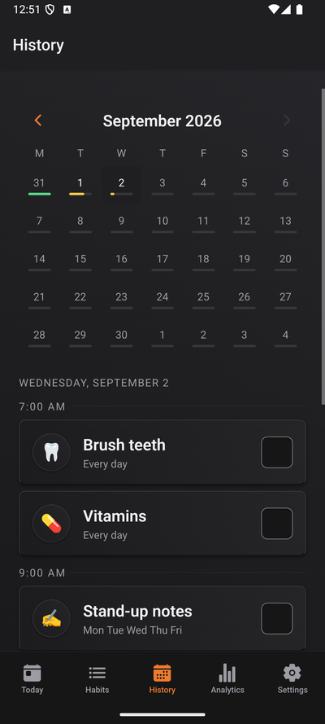
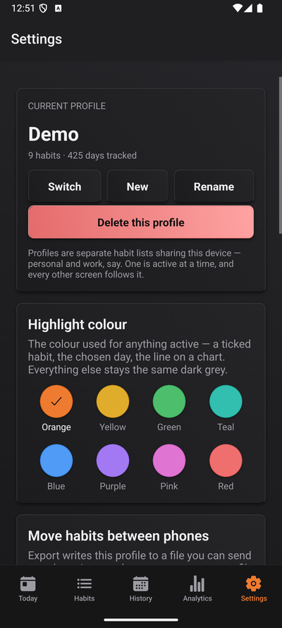

Groove is a local-only habit tracker for one phone: mine. It's also my first phone app, a
deliberate way into mobile after building mostly for desktops and terminals. The name is a music
thing (I'm a big music guy) that happens to work twice over: you groove to a song, and you also
"find your groove" when you're in the zone, actually doing the things you meant to.

## Why I built it

I've bounced off a lot of habit trackers. The popular ones never fit: too complicated, or too
locked down, and always wanting an account and a server for something that is, at heart, a list
of checkboxes. I wanted the opposite. Real control without the complexity. No fancy services, no
remote database, no AI. Just a simple tracker that runs on my phone and looks good.

The honest reason it exists is that I'm lazy, and I mean that as a compliment. Lazy people
engineer their way out of work, it's a calling. The catch is that the same instinct makes it easy
to forget or put off the things you actually signed up for. Groove is where I keep those
obligations honest, and it's built for exactly one user with exactly those needs: me. It's open
source and anyone's welcome to it, but I never designed it for a crowd.

<Callout type="info">
  Everything lives on the device. No server, no account, no network. That's the whole point,
  privacy and simplicity, but it has one consequence I took seriously: a lost phone is lost data.
  So export and backup are first-class, not afterthoughts.
</Callout>

## My first phone app

I'd never shipped anything for a phone before this, and I went in on purpose. I've got plans to
make Kioku and other tools mobile, and a small, self-contained app felt like the right way to
actually learn React Native and Expo rather than just read about them. It slots neatly into the
toolbox next to the front-end work I've been doing. I'm still far from an expert on what mobile
can do, and that was sort of the point: Groove is the gateway.

## What it does

### Today, and only today

The Today screen shows the habits that are actually due, grouped by the time they're due, each one
a single tap to tick off. Nothing you don't need to see right now is on it.

<ImageGallery>





</ImageGallery>

A habit is either daily on a weekday mask (Mon to Thu, every Sunday, every day) or a flexible
target, three times a week, twice a month. History lets you edit any past day, full control over
what you did and when, but never the future.

### Reminders that nag on purpose

Most apps treat nagging as a nuisance to minimise. I wanted the opposite. Reminders are opt-in,
and turning them on for a habit is me telling my phone: chase me until this is done. A
notification fires at the due time, then follows up until I tick the box, at which point the rest
of the chain cancels itself. It's per habit, off by default, and tunable from zero to three
follow-ups, a gentle nudge for some things, a proper pest for the ones I'll otherwise blow off.

### An honest grade

This is the part I cared about most. Plenty of trackers show you numbers; I wanted mine to be
honest. Groove grades you against the days a habit was actually scheduled, hands you a letter
grade and a completion rate, and draws a ninety-day trend. Either I'm passing or I'm not, and I'd
rather see the real line than an unbroken streak that flatters me. A missed day counts against
you; a day you deliberately skip, ill or away, drops out of the denominator instead of reading as
a failure.

<ImageGallery>





</ImageGallery>

Everything else follows from "one phone, one user": profiles for separate lists (personal, work)
with no login, transfer that imports a file as a new profile and can never overwrite what you
have, a full JSON backup through the share sheet, and a dark theme with eight contrast-checked
highlight colours.

<ImageGallery>







</ImageGallery>

## The part I care about most: testing

If there's one thing I believe about building software, it's that testing is foundational, and
never more so than now. In the age of AI you cannot stop at a generative system saying "looks
correct." Humans do that plenty on their own, and they're wrong plenty too. You test extensively,
so a function does exactly what it should for the inputs it expects, and you lean on AI for the
thing it's genuinely good at here: dreaming up the edge cases to cover before anything ships. Will
that catch everything? No. But neither did we when it was only humans.

Groove has 378 tests, and they all run in plain Node in about a second, no device, no emulator.
That isn't luck, it's a decision: the real logic (what's due, the schedule, the stats, the
reminder plan) is pure functions with no React and no SQLite in them, sitting outside the screens.
The one function that decides what's due is called by the Today screen, the history editor, the
analytics, and the notification planner alike.

The database backs that up by making bad states impossible instead of trusting a form to. The
rules live in the schema:

```sql title="src/lib/db/schema.ts (excerpts)"
-- one completion per habit per day: "done twice today" is not a state this app has
CREATE UNIQUE INDEX idx_completions_habit_day ON completions (habit_id, day);

-- a habit on no days can never come due, so a zero mask is rejected outright
weekday_mask INTEGER NOT NULL DEFAULT 127 CHECK (weekday_mask BETWEEN 1 AND 127),

-- no "Personal" sitting above "personal" in the profile switcher
CREATE UNIQUE INDEX idx_profiles_name ON profiles (name COLLATE NOCASE);
```

But the part I'm proudest of is that the test harnesses are faithful, not convenient, and both
caught themselves being wrong before they caught anything else:

<Callout type="warning">
  The SQLite adapter first ran with Node's default of foreign keys **on**. Real SQLite leaves them
  off, and so does expo-sqlite on the second connection it opens, so my first tests happily passed
  against a codebase where every `ON DELETE CASCADE` was silently doing nothing on a real phone.
  The reminder harness had the same disease: it waited "a microtask or two" before simulating a
  notification firing, which let the code read the tick it was supposed to be racing. It passed
  against the broken version too.
</Callout>

A convenient-but-unfaithful harness is worse than no test at all, because it turns an unknown risk
into false confidence. Both of those traps are written down in the repo so nobody, me included,
quietly simplifies them away later.

## Where it's going

Groove is at MVP, and honestly I want to leave it there a while and just live on it, smoothing the
rough edges that real use turns up. From here it's maintenance and bug-fixing more than new
features. If the itch to expand or actually publish ever hits, the door's open to a remote
database, accounts, and a web version. But it already did its main job: it was my way into mobile,
and the next place those lessons go is making Kioku work on a phone.

<Roadmap
  shipped={[
    "Today, history, and habits on weekday or flexible-target schedules",
    "Opt-in reminders that chase until you tick, then cancel the chain",
    "Honest analytics: a grade, rate against scheduled days, 90-day trend",
    "Profiles, plus import/export and a full JSON backup",
    "Dark theme with eight contrast-checked accent colours",
    "378 tests running in Node in about a second",
  ]}
  inProgress={[
    "Living on it daily and smoothing rough edges as they surface",
  ]}
  planned={[
    "A remote database and accounts, if I ever want sync",
    "A web version",
    "iOS (it's Android-first today)",
    "Taking what I learned here and making Kioku mobile",
  ]}
/>

## Tech stack

| Layer | Technology | Role |
| --- | --- | --- |
| Framework | Expo SDK 57, React Native 0.86, React 19 | The app itself, one TypeScript codebase |
| Navigation | expo-router | File-tree routing: the folder layout is the navigation |
| Storage | expo-sqlite | The on-device database, the only source of truth |
| Reminders | expo-notifications | Local due-time alerts and their follow-up chains |
| Validation | Zod | Guards every backup and import file at the boundary |
| Tests | Vitest + Jest | Pure logic and the SQLite and notification harnesses, plus component tests |
