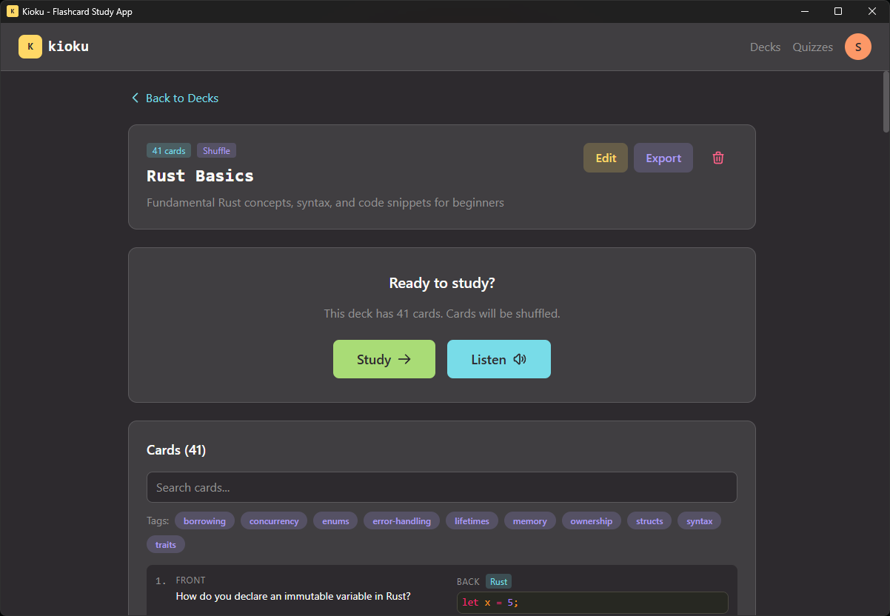
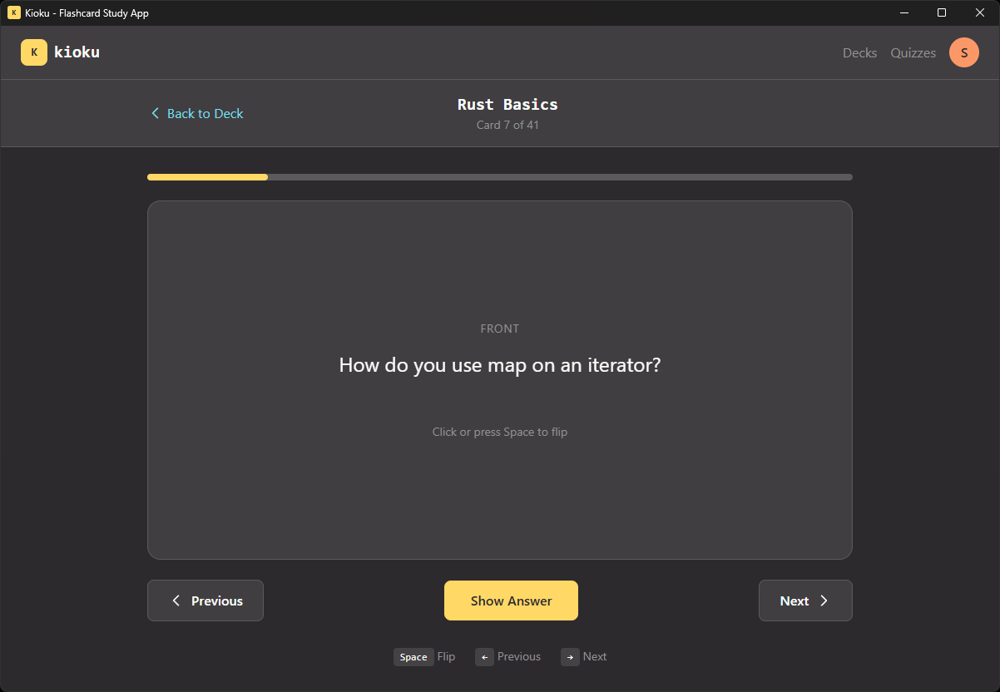
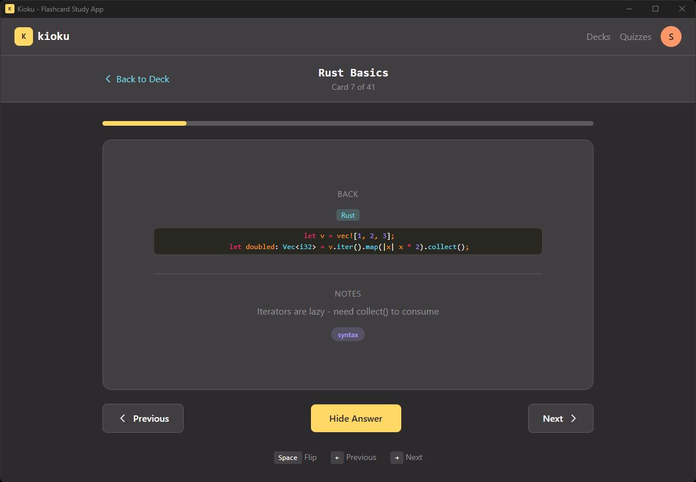
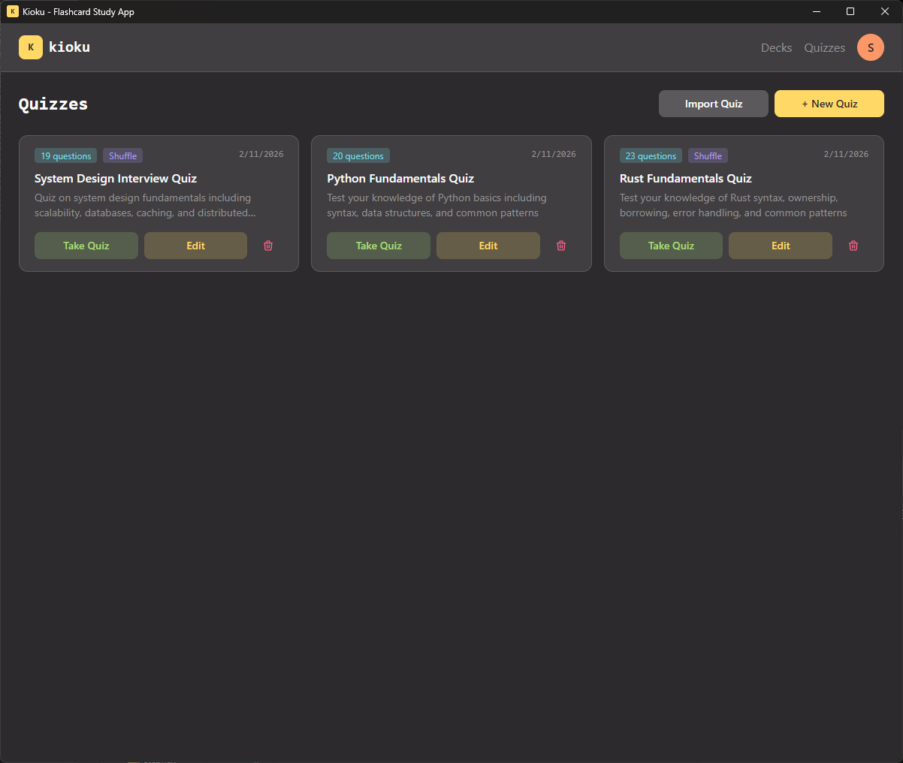
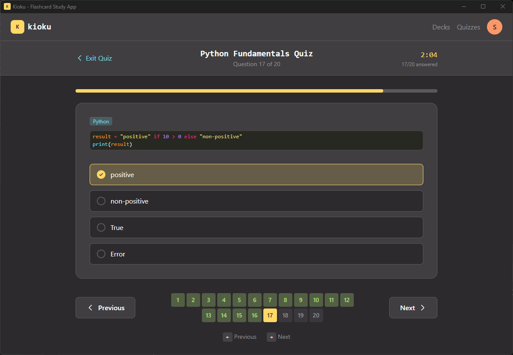
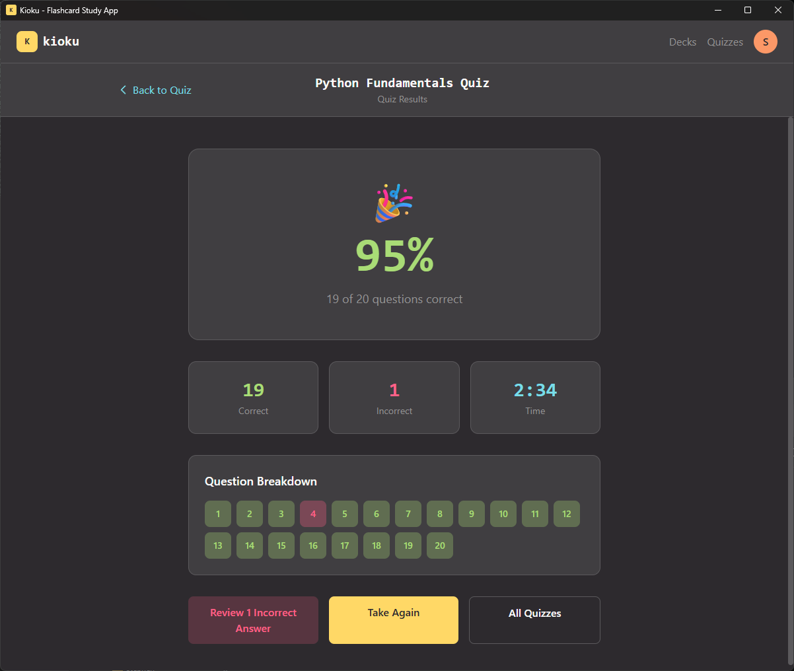
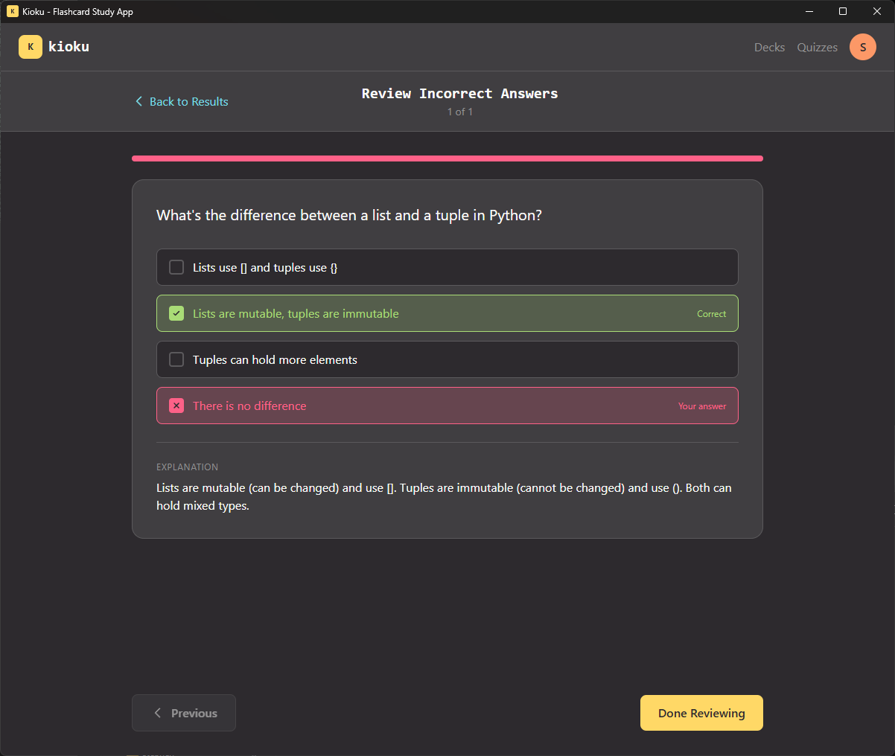

Kioku (記憶, Japanese for *memory*) is a local-first desktop study app for flashcards, quizzes, and
soon notes, all quick to create, fully import/exportable as plain files, and studied entirely offline.

## Why I built it

After college I got the itch to learn a language. I'd only ever taken Spanish, and that was long gone
by this point. I wanted something more interesting and challenging, ideally with a practical payoff,
since I actually want to use the language when I travel. Japanese was an easy call: alongside computer
science I minored in history, and most of my history classes were on East Asia, the modern history of
China and Japan especially. I'm a sucker for that era of the region: the rise of companies like
Nintendo and Chumby, a century of engineering, the whole aesthetic. So, Japanese it was.

Then I sat down to study and hit a wall. Making flashcards is a pain in the ass, and if you're like
me, you like things *neat*. I can't stand messy cards: crooked cuts from trying to get two cards out
of one index card, a whole sentence I have to redo because I fumbled a word in Sharpie. And it wasn't
just cards. The lessons, the study plans, the quizzes, every way I wanted to study was busywork
standing between me and any real learning. So if it's not going to be physical cards, it's digital.
But I looked at the other apps and didn't want to buy into someone else's system: no room to expand
it, no syntax highlighting for code, no text-to-speech the way I wanted. That's about when I said,
"screw it, I can make it better."

## The ideas that make Kioku different

### One place, easy data

Kioku is meant to be one stop for all of it: cards, notes, quizzes, and lessons. My main rule is
*easy data*: everything lives in a common, transferable format. Notes are markdown, so if I want to
write some and drag them into Obsidian, that's trivial. Cards and quizzes are JSON, about the
friendliest format there is from both a code and an AI standpoint.

### Bring your own AI

That format choice is also what makes content fast to make. Kioku has **no AI built in**, and it
doesn't need any. Take the schema to ChatGPT, Claude, or whatever you use, and have it spit out a deck,
a quiz, or a set of notes. I made that part easy: the schema sits right in the help page, ready to
copy. And it goes both ways: export anything, hand it back to an AI to clean up, reimport it. The
whole loop is fluid, and it doesn't lock you into one model or one company's idea of how you should
study.

Here's one of those generated decks, greetings from Genki I, ready to import:

```json title="decks/japanese/genki-greetings.json"
{
  "name": "Genki - Greetings & Common Expressions",
  "shuffleCards": true,
  "cards": [
    {
      "front": "Good morning (polite)",
      "back": "おはようございます\n(Ohayou gozaimasu)",
      "notes": "Used until around 10-11 AM. Casual form: おはよう",
      "tags": ["greetings", "polite", "morning"]
    },
    {
      "front": "Nice to meet you",
      "back": "はじめまして\n(Hajimemashite)",
      "notes": "Said when meeting someone for the first time",
      "tags": ["greetings", "introduction"]
    }
  ]
}
```

Quizzes are the same idea: a `questions` array of `multiple_choice` and `fill_in_blank` items, each
with its own explanation, so a whole study set is one readable file.

### Goals and progress

I also wanted to set goals and actually see where I'm tracking. Kioku records how long I study, how
many cards I've gone through, which quizzes I pass, and what I got wrong. That's useful now because I
can shape the data myself, but it's really the groundwork for what's next: adaptive learning that
puts the stuff you're worst at in front of you more often. And it should all connect: the quizzes
working with the cards and the lessons, so it's one cohesive thing instead of a pile of separate
features.

## What it does

### Flashcards that love code

A deck is text or code, and code gets the real treatment: VS Code's syntax highlighting for 50+
languages. I added that for a slightly self-indulgent reason: Kioku's own desktop backend is written
in Rust, and I wanted to study Rust *in the app I was building it with*. A card on an ownership rule
looks like Rust, not a paragraph. Flip with a click, tap, spacebar, or the arrow keys; shuffle it up;
or turn on the listen mode and let a deck read itself back to you. Tag and filter your cards, search a
deck, and drill just the subset you keep missing.

<ImageGallery>







</ImageGallery>

### Quizzes

Cards are good for *recognizing* an answer; quizzes make you actually *produce* it. Multiple-choice and
fill-in-the-blank, including questions with more than one right answer, each with an explanation and a
spot in your history, so you can see what's sticking and what keeps slipping.

<ImageGallery>









</ImageGallery>

## Under the hood

Kioku started as a web app, but I took it local-first with a full desktop version built on **Tauri**:
a React front end over a Rust core, compiled to a small native binary for Windows, macOS, and Linux,
with a real SQLite database (via rusqlite) sitting on disk.

<Callout type="info">
  Local-first isn't just about privacy. It changes how the app feels: no spinner on launch, no
  "you're offline," no account wall between you and a five-minute session. Your whole library is one
  SQLite file; back it up by copying it.
</Callout>

## Does it actually work?

It's not a demo I built and walked away from. I use it constantly. I've made dozens of decks: Japanese,
Rust, Python, RHCSA, plain CS fundamentals. It's earned a real spot in both my studying and my
professional prep, which is about the only endorsement a study tool needs.

It's also turned out more general than I planned. A friend's kid is studying for her learner's permit,
so I generated her a set of practice tests to drill. Same app, totally different subject. Which is
exactly why images are on the list: a permit test without road signs is only half a test.

## Where it's going

- **Study anywhere, sync like Git.** A local copy that always works offline, changes pulled
  automatically, and when two devices disagree, *you* decide which cards win: full control instead of
  a silent last-write-wins that eats an edit. Overkill for a casual user, maybe, but cards and decks
  *are* structured data, so treating them like a repo fits.
- **Notes.** Markdown notes that live alongside the cards they came from, in development now.
- **Images.** Not there yet, but high on the list: kanji, diagrams, road signs.
- **Adaptive learning.** The progress tracking above is the foundation, surfacing what you're worst
  at, more often.

## Tech stack

| Layer | Technology | Role |
| --- | --- | --- |
| Frontend | React 19, TypeScript, Tailwind v4 | The UI: components in TypeScript, styled with Tailwind |
| Desktop | Tauri 2 (Rust) | Packages the app as a native desktop binary |
| Database | SQLite via rusqlite | The on-disk store for every deck, card, and stat |
| Code editor | VS Code | Renders and highlights code on the cards |
| Routing | React Router v7 | Navigation between the app's screens |
