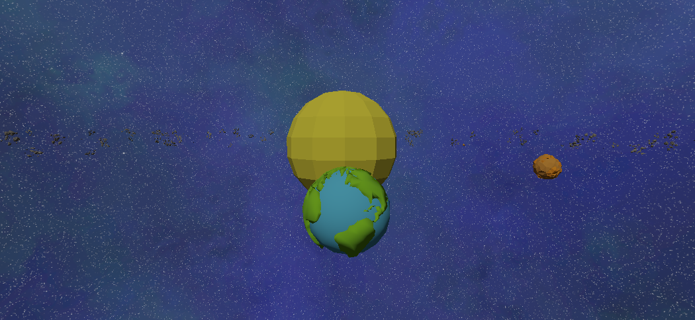
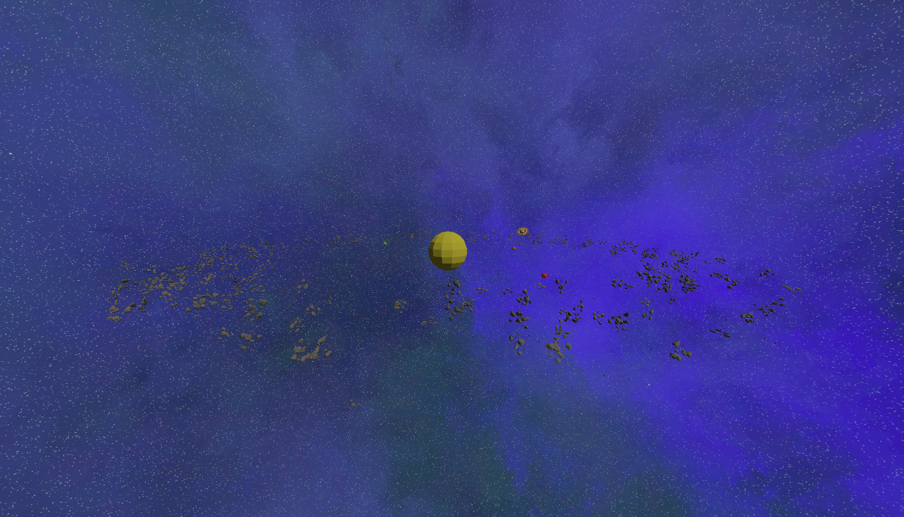
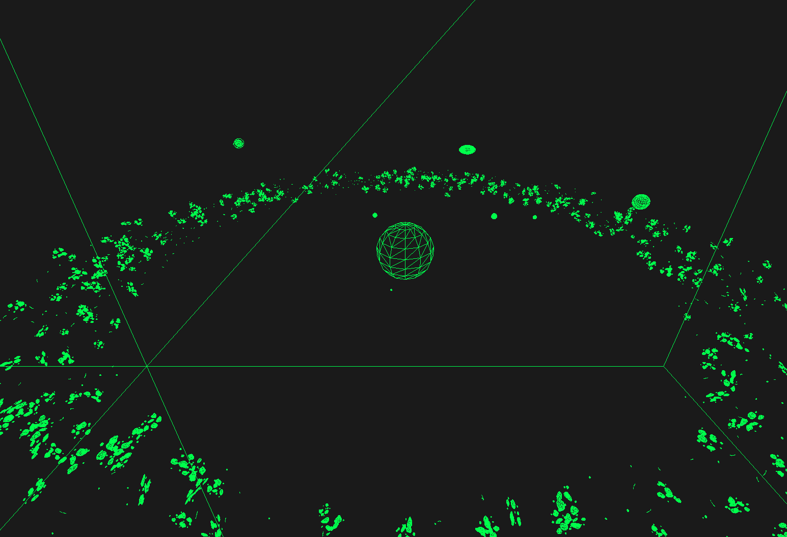
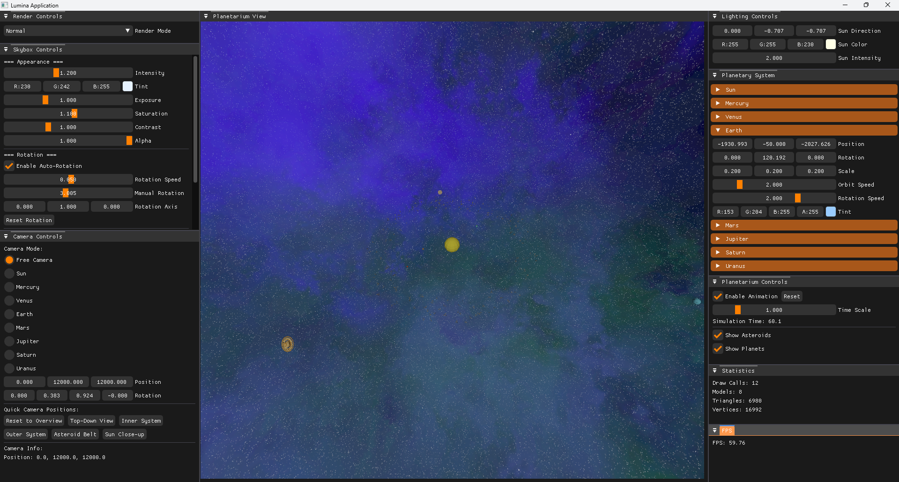
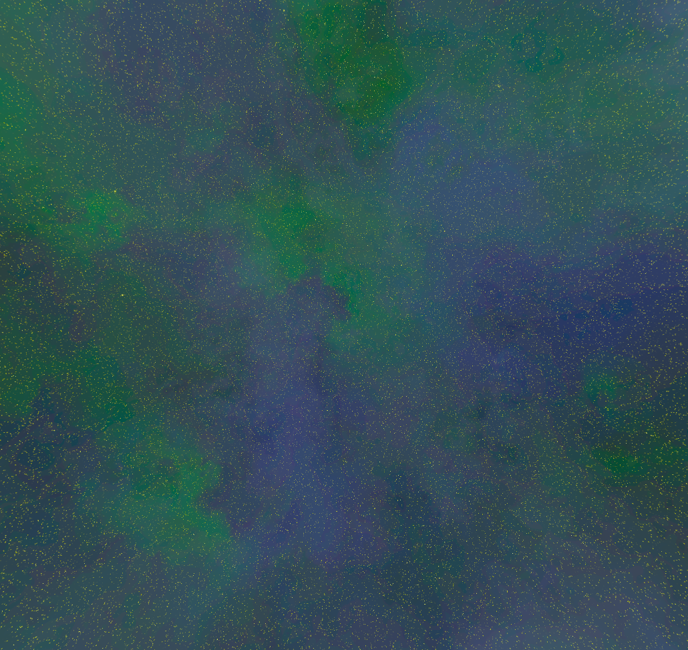
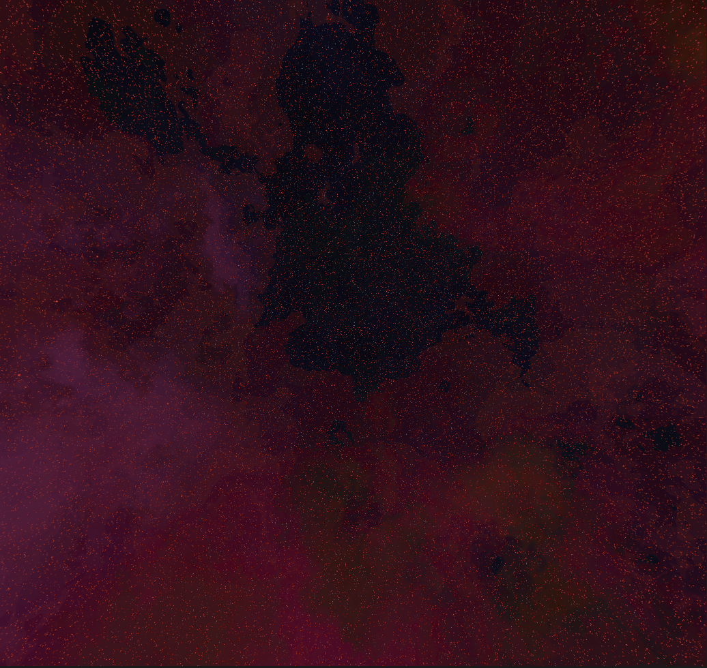
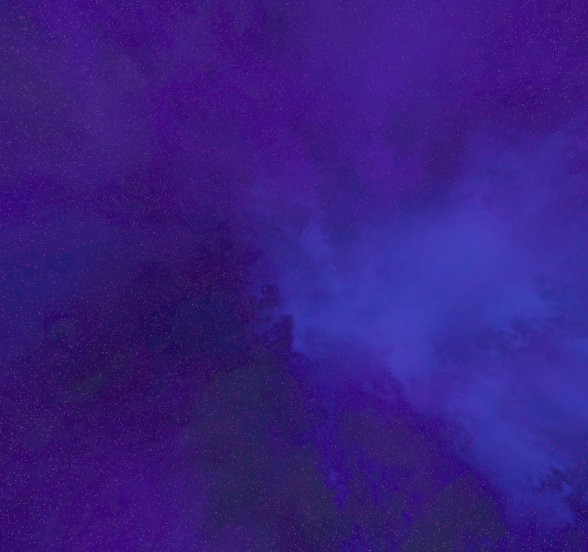
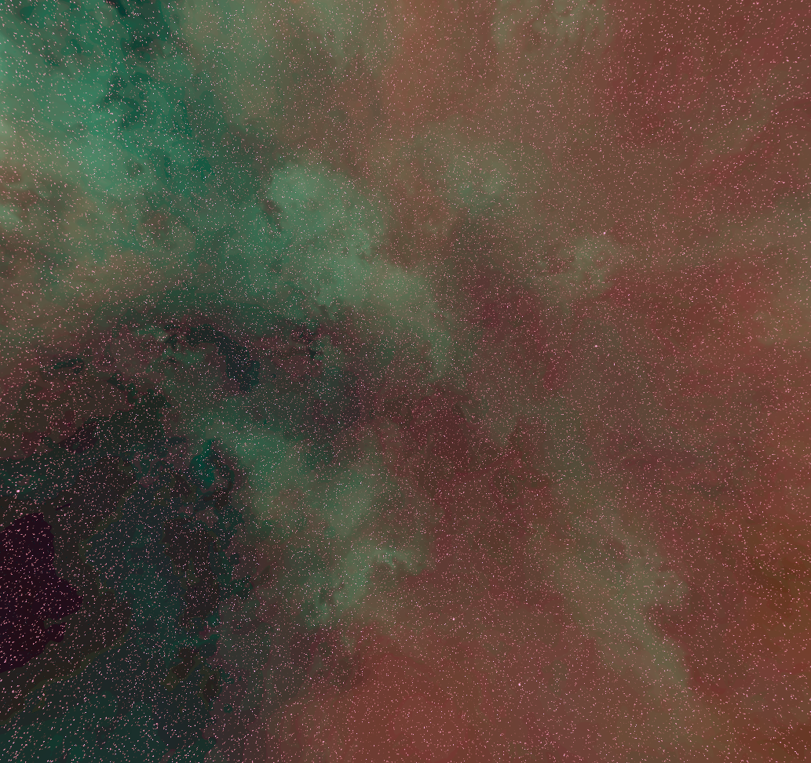

Orbital Engine is a real-time 3D solar system you can fly through. I built it for two reasons at
once: I've always been a sucker for space, and I needed something demanding to push the 3D side of
my own C++ application framework. A solar system turns out to be a great stress test, plenty of
bodies in motion, real lighting, and a camera that has to be able to go anywhere.

## Why I built it

I'd written my own C++ application framework (Lumina) and wanted to actually lean on its 3D path,
not just prove it compiled. Orbiting planets, thousands of asteroids, dynamic lights, and a wrap-around
skybox exercise most of a renderer at once, so if the scene ran smoothly, the framework underneath
was earning its keep. And honestly, space is just a joy to render.

## What it does

- **A solar system in motion.** Planets on animated orbits with adjustable time scaling, so you can
  crawl through an hour or race through a year.
- **A camera that goes anywhere.** Free-roam, planet-following, and preset shots: top-down, inner
  system, the belt, a sun close-up.
- **An instanced asteroid belt.** Thousands of individual rocks, drawn in one pass and toggleable.
- **Real lighting.** A directional sun and point lights driving the illumination.
- **Swappable skyboxes.** Tint, intensity, and rotation on a wrap-around space backdrop.
- **A live performance overlay.** FPS, draw calls, and triangle counts, so the cost of a change is
  never a mystery.

<ImageGallery>

</ImageGallery>

## The rendering, and the part I like

Everything runs through the framework's OpenGL pipeline: a model registry for loading meshes, a
shader path that handles multiple light sources, and a quaternion camera so there's no gimbal lock
when you fly straight up over the sun.

<Callout type="info">
  The asteroid belt is the piece I'm happiest with. Thousands of asteroids aren't thousands of draw
  calls, they're one instanced draw: the mesh is uploaded once and the GPU stamps it across the belt
  from per-instance transforms. That's the difference between a slideshow and something you can
  actually orbit through.
</Callout>

Three render modes, normal, wireframe, and points, let you peel the scene back to the geometry, and
a skybox pass wraps the whole thing in a space environment you can retune on the fly:

<ImageGallery>

</ImageGallery>

## Where it's going

Orbital Engine is one of the projects I most want to come back to and rebuild properly, so a major
overhaul is on the way. What's here is where it stands today, not the finished form.

## Tech stack

| Layer | Technology | Role |
| --- | --- | --- |
| Language | C++ | The simulation and rendering logic |
| Graphics | OpenGL 3.3+ | The pipeline the whole scene runs on |
| Framework | Lumina, my C++ application framework | The app shell: windowing, the OpenGL layer, and the UI |
| UI | Dear ImGui | The camera, lighting, and simulation control panels |
| Build | Visual Studio (Windows) | Where it compiles and runs |
