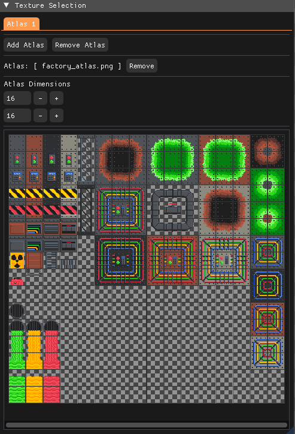
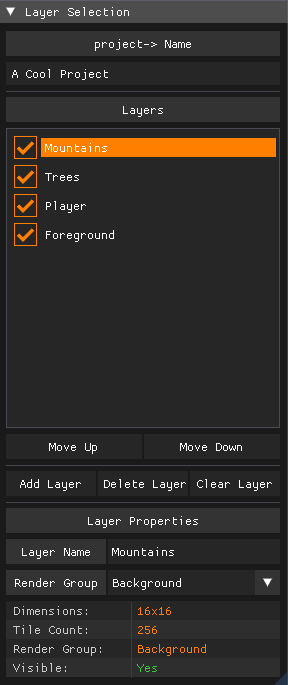
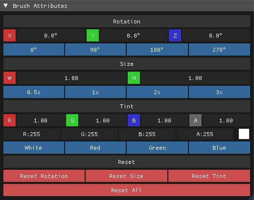
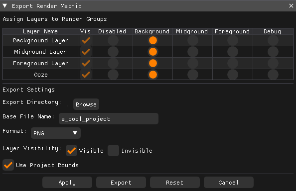
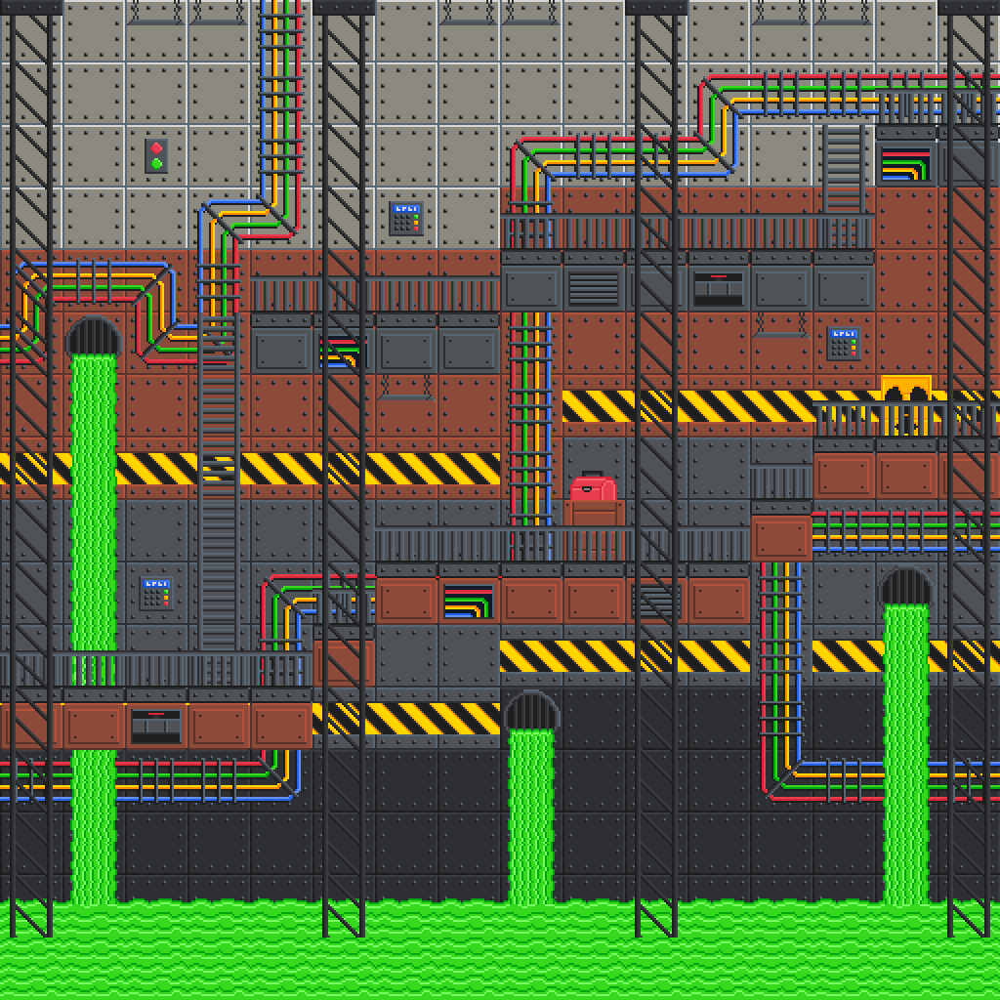
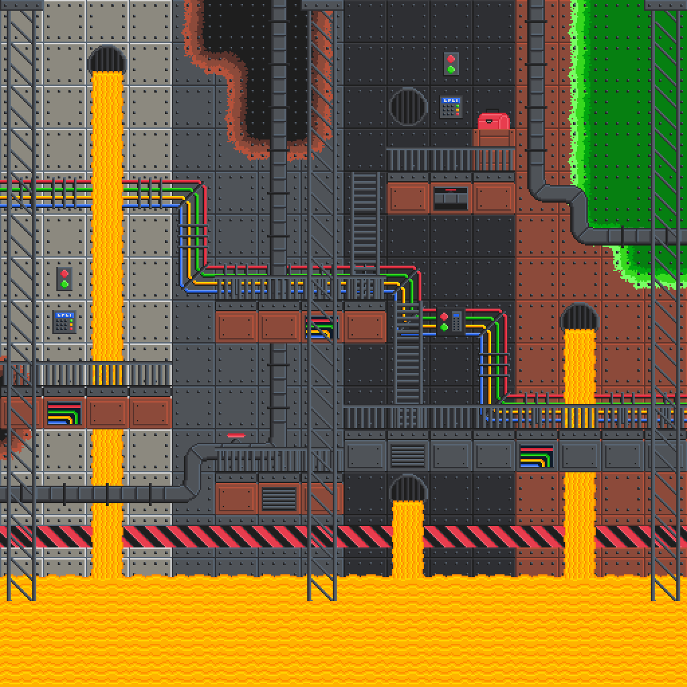
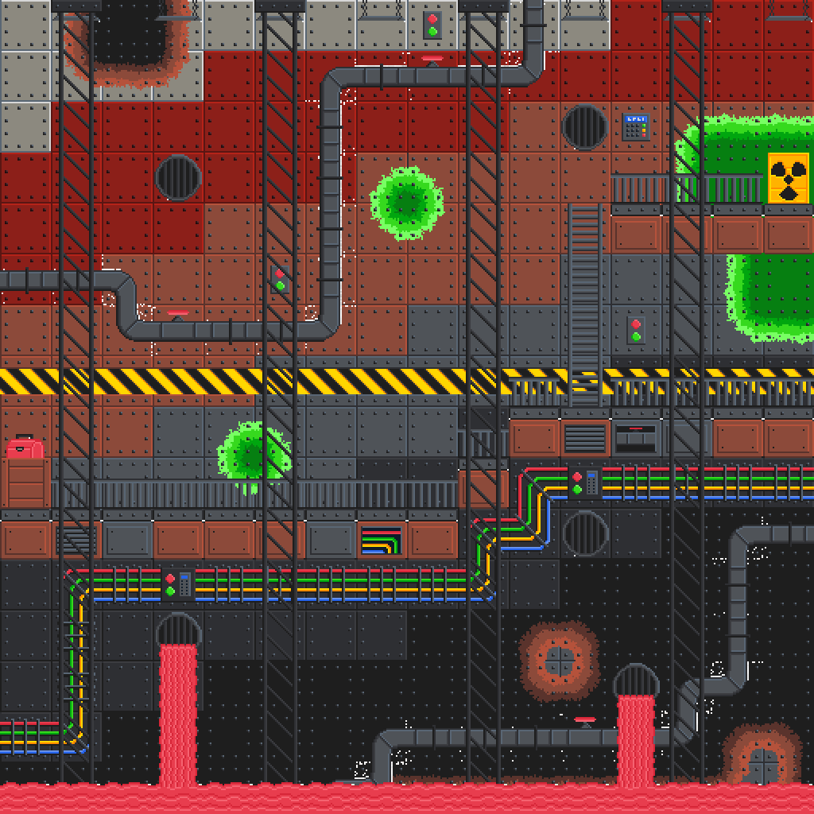

Tiles is a 2D map editor for building detailed tile worlds out of your own texture atlases. I
wanted a focused, modern take on tile-map editing, and I wanted to write the whole thing myself,
the renderer included, rather than lean on a game engine to do the heavy lifting.

## Why I built it

Tile editors already exist, and good ones. But I wanted my own streamlined version, and more than
that, I wanted the excuse to build the rendering from the ground up. A map editor is a great
project for exactly that: it needs a fast 2D renderer for a grid of thousands of tiles, and a real
editing interface sitting on top of it. So I built both.

## What it does

- **Layer-based editing.** Organize tiles into layers you can reorder, rename, and toggle while you
  work, so a busy map stays manageable.
- **Brush, erase, and fill.** Paint with adjustable rotation, size, and RGBA tint, or flood a region
  in a single click.
- **Bring your own atlas.** Import a texture atlas, set its grid dimensions, and pick tiles straight
  from it.
- **A flexible export matrix.** Assign layers to groups, then flatten a project into one PNG or
  split it into several.
- **Save and load.** Projects keep every layer and texture reference, so you can pick a map back up
  later.

<ImageGallery>

</ImageGallery>

## How it works

Tiles doesn't sit on a game engine. It ships with its own built-in application framework, and at
the center of that is a state-based batch 2D renderer written in OpenGL, handling the pipeline, the
window, and real-time editing. The interface (the layer panel, brush attributes, atlas selection)
is built on an immediate-mode UI.

<Callout type="info">
  Batching is what makes it feel instant. A tile map is thousands of little quads, and drawn one at
  a time that would crawl. The renderer collects them into batches and pushes each in a single draw,
  so painting across a big map stays smooth instead of dragging as it fills in.
</Callout>

The rendering layer took its cues from TheCherno's Walnut framework, and the editor itself from the
Tiled map editor, the goal being a leaner, more modern take on tile-based world building.

## Example maps

A few maps built entirely in Tiles, to show what the editor puts out:

<ImageGallery>

</ImageGallery>

## Where it's going

Tiles is another one I'm planning to majorly overhaul, so consider this its current form. A proper
rework is on the way.

## Tech stack

| Layer | Technology | Role |
| --- | --- | --- |
| Language | C++ | The editor and its renderer |
| Graphics | OpenGL | The batch 2D renderer everything draws through |
| UI | Dear ImGui | The layer panel, brush controls, and atlas picker |
| Framework | My own built-in app framework | Windowing and the app shell, Walnut-inspired |
| Build | Visual Studio (Windows) | Where it compiles and runs |
